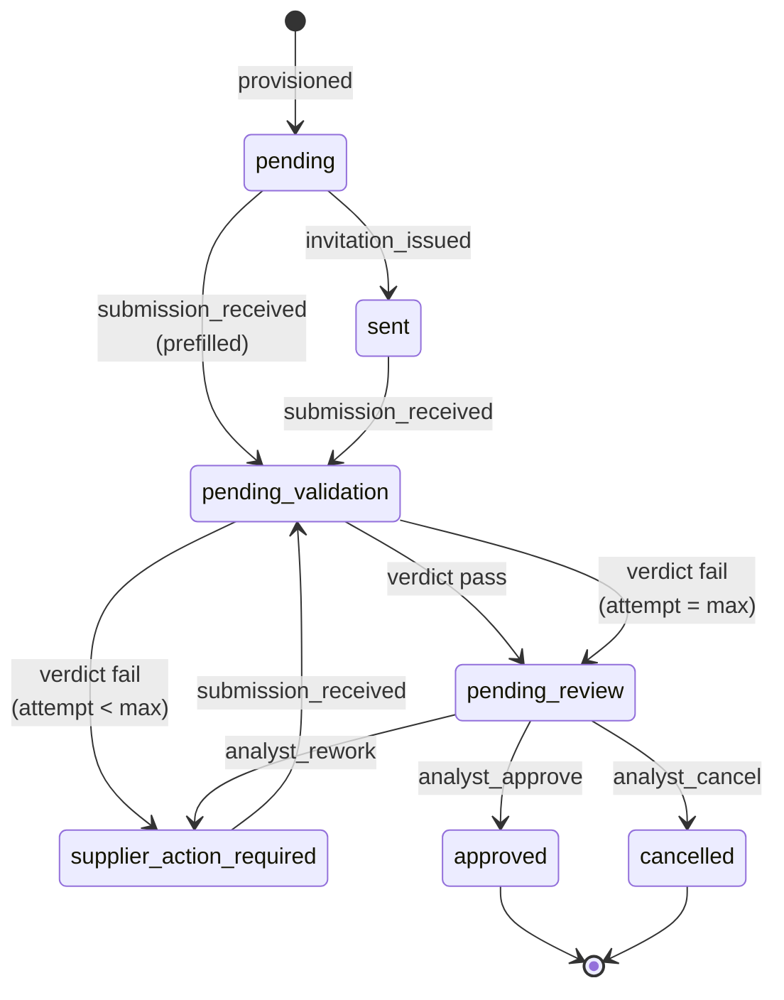
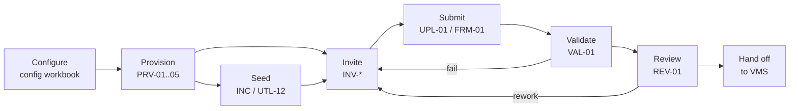

# SDC on one page

2026-09-21

The Supplier Data Collection platform described independently of the platform it runs on. Every workstream should be able to cite this page; anything it cannot cite belongs here or is out of scope.

## What SDC is

SDC collects structured data from a customer's suppliers, validates it against that customer's rules, has an analyst review it, and hands the accepted result to the customer's downstream system (a VMS such as VNDLY).

Four kinds of actor take part. The **customer** defines what data is wanted. The **analyst** (Randstad side) configures the engagement, reviews submissions, and repairs anything stuck. The **supplier** and its **supplier users** fill in and submit the data. The **platform** invites, reminds, validates, reports, and keeps the record.

One engagement is one **project** for one customer: a configuration (fields, allowed values, cascades, validation rules), a template built from it, a set of supplier requests, and the submissions against them. Optional **seed data** pre-fills what the customer already knows about each supplier.

The outcome, per supplier request, is exactly one accepted submission or a cancellation, with the submitted file and its validation report retrievable afterwards. Everything else on this page exists to make that outcome reliable.

## Entities

SDC has about a dozen nouns, and they fall into the three seams you named on 21 September: **shape** (what data is wanted), **roster** (who supplies it), and **data** (what was supplied). Shape changes only through config updates; roster changes only through app actions after provisioning; data is validated against shape and routed by roster. A config update never touches suppliers or users.

| Seam | Entity | What it is | Record today |
| --- | --- | --- | --- |
| — | Project | One customer engagement. Singleton per workspace. Carries customer attributes, target VMS, reminder days, `max_submission`, output folder, `external_request_id`. | `Project` table |
| Shape | Config | The customer's definition of the data: fields, allowed values, cascades, complex validations, users, suppliers, seed-file coordinates. Authored by the analyst. | Config workbook (`master_config` v0.9.9) + container-bound shim |
| Shape | Template version | One frozen build of the config: `parsed_config` → canonical model (`cfg_fields`, `cfg_lookups`, `cfg_rules`, `cfg_variants`, `cfg_variant_fields`, `cfg_form_slot_mappings`, `cfg_error_messages`) → XLSX template. Keyed by `config_fingerprint`; `draft` or `published`; files under `/templates/v{n}/`. | `CFG_TemplateVersion` + FileStorage |
| Shape | Variant | A template variant for a class of supplier; TPL-01 resolves version and variant. | canonical model |
| Roster | Supplier | A supplier organisation in the engagement. | `SUP_Supplier` |
| Roster | Supplier user | A person at a supplier. One is the primary contact; the primary-contact flag is separate from who holds the task. | `SUP_SupplierUser` |
| Roster | Supplier request | The whole of one supplier's engagement: exactly one per supplier, moved in place by re-versioning (MIG-01), never duplicated. Holds `status`, `collection_mode` (`request` or `prefilled`), `template_path`, `submission_attempt`, `reminders_enabled`. | `SUP_SupplierRequest` (+ `WFA_SupplierRequest` mirror) |
| Roster | Task | The WFA assignment that lets a supplier user act on a request. Has a holder, a status, and an expiry. At most one live task per request (confirm). | WFA task |
| Data | Seed data | What the customer already knows about each supplier, from the VMS bulk-load sheet (Sony/VNDLY: "People - Contractors", header row 5, data from row 7). Reconciled to the roster by an index key; produces prefilled requests. | seed file in Drive/FileStorage; `submission_source = analyst` |
| Data | Submission (upload) | One attempt by a supplier or analyst, via XLSX upload or the form channel. | `RUN_Upload` + file under `requests/<id>/` |
| Data | Validation result | The verdict on one submission: status, summary, errors. Re-renderable as a report on demand. | `RUN_ValidationResult` + `reports/` JSON |
| Data | Manual entry | Form-channel staging rows, later rebuilt as a filled XLSX so downstream sees one shape. | `RUN_ManualEntry` (STG-01 sole writer) |
| — | File link | A time-limited share link to any stored file (7-day TTL). Derived, never stored as truth. | UTL-01 |
| — | Correlation id | Per-call trace id. Not a recovery key; `config_fingerprint` is. | columns on most rows |

Relationships: a Project has many template versions and many suppliers; a supplier has many users and exactly one request; a request has many submissions; a submission has one validation result; a request has at most one live task.

## Lifecycle

A request moves through one sequence, and every departure from it is an analyst move with a named trigger. Request mode: `pending → sent → pending_validation → pending_review → approved`. Prefilled mode skips `sent`, because the analyst's submission is the hand-off: `pending → pending_validation → pending_review → approved`. `supplier_action_required` is the rework loop in both. `cancelled` is terminal.

Read it left to right: the platform drives the straight path, the analyst drives every branch. A system validation error (`system_validation_error`) returns the request to the state it came from rather than blaming the supplier.

| Trigger | Emitted by | From | Notes |
| --- | --- | --- | --- |
| `invitation_issued` | INV-01 | `pending` | R-1 fires provisioning once; INV-01 again is the only recovery after a failed activation |
| `submission_received` | UPL-01, UTL-011, FRM-01, analyst "Submit seeded file" | `sent`, `supplier_action_required`; `pending` for prefilled | `submission_source` = `supplier` or `analyst` on RUN_Upload |
| verdict (`pass` / `fail`) | VAL-01 via `finalize_verdict` | `pending_validation` | the Nth failed attempt (N = `max_submission`) routes to the analyst, not back to the supplier |
| `system_validation_error` | VAL-01 | `pending_validation` | validation itself failed; not a supplier fault |
| `analyst_approve`, `analyst_rework` | REV-01 | `pending_review` | live |
| `analyst_cancel` | none yet | any open state | legal in STS-01, no emitter |
| re-open, re-send, re-seed | not yet defined | closed or stuck states | each needs a token, a legal triple, and a derivation row before any recipe emits it |

The WFA stage is a projection of `status`, not a second state: `pending` → "Pending assignment to supplier", `sent` and `supplier_action_required` → "Awaiting data submission", `pending_validation` → "Validation in progress", `pending_review` → "Under review", `approved` → "Accepted", `cancelled` → "Canceled". A request is stranded whenever the two disagree, and today they can, because two recipes write the projection (STS-01 for task-less states, INV-01a for task-bearing ones).

## Invariants

These are the rules that must hold no matter which recipe runs. Most are already stated in the seed-data handoff; the rest are scattered across recipes and are collected here so they stop being tribal.

**Structure**

1. One customer per workspace; one Project per workspace; one request per supplier. Re-versioning migrates the request in place (MIG-01) and never creates a second one.
2. Shape, roster and data are separate seams. A config update never touches suppliers or users; roster changes only through app actions after provisioning; data is validated against shape and routed by roster.
3. A template version is frozen. Its canonical model and files under `/templates/v{n}/` do not change after publication; a changed config is a new version, detected by `config_fingerprint`.

**State**

4. `status` on `SUP_SupplierRequest` is the one state. The WFA stage, the task, the reminder schedule and every dashboard are projections of it.
5. Every fact has one writer. Target: one recipe writes `status` and its projection on the same path. Today the projection has two writers (STS-01, INV-01a), which is the standing source of stranded requests.
6. The platform drives the sequence; only the analyst departs from it. Every departure is a named `analyst_*` trigger, issued from a WFA analyst function, never from a scheduled or table-triggered recipe and never from the provisioning webhook.
7. `finalize_verdict` is the only place a verdict becomes a trigger. No recipe maps pass/fail to a status itself.
8. A trigger is legal only as a (from, trigger, to) triple in STS-01. A recipe that emits a trigger not in the table is a bug, not a feature.
9. The Nth failed submission (N = `max_submission`) goes to the analyst, enforced at the routing seam only; no supplier-facing gate.

**Files and boundaries**

10. Bytes never cross a recipe boundary. Whoever holds bytes writes them to FileStorage and passes a path; callers pass ids and paths. The one place bytes enter is a WFA app function's file input, and that recipe stores them itself.
11. The document cache is a hand-off, not storage. The durable home is `requests/<id>/`, `templates/v{n}/` or `reports/`, and the recorded path is always the durable one.
12. File content arrives as bytes or base64; branch on the magic number (`504b0304` raw XLSX, `55457344` base64), never decode unconditionally.
13. Share links are derived (7-day TTL) and UTL-01 is their only owner. A stored link is a bug.

**Logic**

14. The connector is pure: no external calls, no file or table I/O. Recipes fetch and pass content in.
15. Excel-facing code stays in Python (openpyxl); the Ruby sandbox has no XLSX reader. Everything else that computes belongs in the connector.
16. One result envelope, one truthiness rule (`true/1/yes/y/t`; blank means unset, never false), one column vocabulary per entity. Every helper that disagrees is drift to remove, not a dialect to preserve. On failure the payload is present and blank, so a downstream pill always resolves to something.
17. The Workato Python runtime is pre-3.12; no nested f-strings reusing the outer quote.

**Operations**

18. Recipe exports cannot be imported. Every change is applied by hand in the editor, so every change ships with an editor checklist, and the golden workspace is the only master.
19. Provisioning is "hydrate data", not "create infrastructure". R-1 fires once from the config tool and does not retry; re-running INV-01 is the recovery.
20. Every provisioning step is idempotent on `correlation_id` (target). Re-running a job is the recovery; there is no compensation.

Mark any of these you disagree with; a disagreement here is cheaper than one in a recipe.

## Owners

Each fact below has one owner, meaning one component allowed to write it. Everything in the last column is derived from it and may be rebuilt from it at any time. Where today's estate has two writers, both are named and the second is the one to retire.

| Fact | Owner today | Target owner | Projections of it |
| --- | --- | --- | --- |
| Config (shape) | Config workbook + `sdc_lib` (GAS) | same | `parsed_config`, canonical model, template XLSX, form slot map |
| Template version | PRV-01…PRV-05 (provisioning chain) | PRV chain, idempotent on `correlation_id` | `CFG_TemplateVersion` row, files under `/templates/v{n}/` |
| Canonical model | CAN-01 (Python) | connector, after the CAN-01 / Functional core overlap is settled | template, form, validation rules |
| Roster (`SUP_Supplier`, `SUP_SupplierUser`) | provisioning, then WFA analyst functions | same | dropdowns, invitations, reminders |
| `status` | STS-01 | STS-01 | WFA stage, task presence, reminder eligibility, dashboards |
| WFA stage | STS-01 (task-less) **and** INV-01a (task-bearing) | STS-01 alone, on the same path as `status` | WFA page state |
| Verdict → trigger | `finalize_verdict` (connector) | same | `trigger_context` consumed by STS-01 |
| Task (holder, status, expiry) | INV-01a creates; INV-02 renews; INV-04 changes primary user | one "ensure task" action; primary-contact flag kept separate | task lists, expired-task views (UTL-06, WFA-002) |
| Submission file | UPL-01 / FRM-01 (the recipe that holds the bytes) | same | `RUN_Upload` row, `requests/<id>/` file |
| Form-channel rows | STG-01 (sole writer of `RUN_ManualEntry`) | STG-01, then rebuilt as XLSX by TPL-02 | filled XLSX, downstream sees one shape |
| Validation result | VAL-01 | VAL-01 | `RUN_ValidationResult`, `reports/` JSON, rendered report, analyst page |
| Seed data → prefilled request | INC-01 / INC-02 (Python) | `validate_seed` (connector) + UTL-12 (store) | prefilled request, `collection_mode = prefilled` |
| Share links | UTL-01 | UTL-01 | every link on every page and email |
| Reminder schedule | REM-02 from Project reminder days + request flag | same, with blank flag read as unset | reminder emails |
| Observability events | every recipe, via OBS-01 (about two thirds of all call edges) | one async emit per job, or a connector method | OBS tables, watchdog |
| Workspace registry | Google Sheet (router) | a database, later | routing of config calls to client workspaces |

Two rows carry the recurring bugs: WFA stage (two writers) and Task (three writers plus a separate primary-contact flag). Fixing those two rows removes most of the stranded-request shapes you have chased this month.

## Flows

Seven flows cover the platform. Each is listed with its entry point, the recipe family that implements it, and what it must leave behind. The recipe codes are the current names; the flows are what would survive a rename.

The straight line is the supplier's path; the two return arrows are the rework loop. Reminders, status, links and observability run beside every step rather than between them.

| Flow | Entry point | Recipes | Leaves behind |
| --- | --- | --- | --- |
| Configure | Analyst edits the config workbook; the shim exports `parsed_config` | GAS `sdc_lib`, DescriptionParser; API-01/02 validate and preview via the router | a validated config with a fingerprint |
| Provision | R-1 webhook from the config tool, once, through the router `/route` | PRV-01…PRV-05, CAN-01, TPL-01/02/03 | Project row, template version, canonical model, template files, roster rows |
| Seed | Analyst uploads the seed file (WFA-016) or API-00 | INC-01, INC-02 → `validate_seed`, UTL-12 | prefilled requests with `template_path` |
| Invite and assign | Provisioning or analyst button | INV-01, INV-01a, INV-01b, INV-03, INV-USER; INV-02 (renew), INV-04 (primary user) | `sent` status, a task on the request |
| Submit | Supplier uploads (UPL-01) or fills the form (FRM-01, STG-01); analyst submits a seeded file | UPL-01, FRM-01, STG-01, TPL-02 rebuild, SUB-01 | `RUN_Upload`, file under `requests/<id>/`, `submission_received` |
| Validate | `submission_received` | VAL-01 → `validate_upload`, `generate_validation_report`, `finalize_verdict`; STS-01 | `RUN_ValidationResult`, report, new `status`, projected stage |
| Review and hand off | Analyst review page | REV-01, LNK-01 / "Surface links", WFA-005 uploads table | `approved` or rework; links to file and report; VMS load |
| Beside every step | schedules and events | STS-01 (status), REM-02 (reminders), UTL-01 (links), OBS-01 (events), UTL-06 / WFA-002 (expired tasks) | — |

The API surface is three endpoints on each client workspace (API-00 at the collection root, `/invitations`, `/portal-invite`) fronted by one router workspace whose `/route` envelope carries `{spreadsheet_id, correlation_id, path, is_initial, payload, payload_version}` and answers `{status_code, body}`.

## Where logic lives

The domain is implemented three times today, and the target is once. This table is the map from one to the other; the Python-to-Ruby work (Wave 1 delivered, applied by hand recipe by recipe) is the first move along it.

| Kind of logic | Today | Target | Move |
| --- | --- | --- | --- |
| Config parsing and validation | Functional core connector (`parse_config_file`, `validate_config`) | same | none |
| Config authoring rules (description → dropdowns, rules, formats) | GAS `sdc_lib` + DescriptionParser | GAS keeps Sheets I/O only; rules move to the connector where they don't touch Sheets | later |
| Canonical model build | CAN-01 Python | connector, Wave 4 (`build_canonical_model`, 844 lines, no openpyxl); may merge with Functional core's config parsing | Wave 4 |
| Template render (XLSX) | TPL-02 Python, openpyxl | Python, stays | none |
| Seed parse and reconcile | INC-01 / INC-02 Python | `validate_seed` in the connector; UTL-12 stores | plan of record in the seed-data handoff |
| Submission validation | `validate_upload`, `generate_validation_report`, `finalize_verdict` | same | none |
| Planning actions (task ensure, primary-user change, reminders, request rows, user migration, request classification) | Python in INV-04, INV-02, UTL-06, REM-02, REQ-01, MIG-01 | DataBridge Compute connector, Wave 1: `plan_primary_user_change`, `plan_task_ensure`, `classify_requests_by_task`, `compute_reminders`, `build_request_rows`, `plan_user_migration` | built; apply by hand, one recipe at a time, with the pill checklist |
| Analyst page data (uploads table) | WFA-005 loops one query per upload | `build_upload_history_rows` (Wave 1 patch) + one query | built, not applied |
| Result envelope, truthiness, column vocabulary | three dialects (Python `_ok`/`_fail` ×7, GAS `Result`, Ruby `result_envelope`) | one: `{ok, error{code,message}}`, `true/1/yes/y/t`, entity object_definitions | retire dialects as each step moves |
| State transitions | STS-01 recipe steps | STS-01, with the legal-triple table as data the connector can check | later |
| Wiring (fetch, call, write, notify) | recipes | recipes, thinner | the contract linter assumes this |

The rule for every new piece: if it computes, it goes in the connector and gets a fixture; if it moves bytes, it stays in Python or the recipe; if it wires, it is a recipe step.

The Python inventory of 10 September found 54 steps and 8,329 lines, one step per recipe. The design record sorted them: 21 to convert (3,706 lines; CAN-01 and WFA-003 are the two large ones, the other 19 average 129 lines), 6 to confirm (U-01, U-02, P-03a, WFA-04c, WFA-05b, WFA-05c, older naming), 6 that stay Python for openpyxl, pandas or zipfile (TPL-02, INC-01, INC-02, UTL-04, P-02b, V-02), 2 test steps, and 19 already stopped. The conversions run in four waves; each step is proven before its recipe is touched by running the original Python on real job inputs, then the Ruby action on the same inputs, and comparing field for field. Where the Python is wrong, the golden is corrected on purpose and the change is written into the action's description.

| Wave | Actions | Replaces | Status |
| --- | --- | --- | --- |
| 1 | `plan_primary_user_change`, `plan_task_ensure`, `classify_requests_by_task`, `compute_reminders`, `build_request_rows`, `plan_user_migration` | INV-04, INV-02, UTL-06, REM-02, REQ-01, MIG-01 | Built as the "DataBridge Compute" connector; 43 of 43 goldens match. Not yet applied. Apply order: REQ-01, then INV-02 and INV-04 together, then UTL-06, REM-02, MIG-01. |
| 2 | `users_to_dropdown`, `uploads_to_dropdown`, `suppliers_to_options`, `join_requests`, `user_activity`, `health_snapshot` | WFA-002b, WFA-005b, UTL-03, UTL-09, UTL-07, WFA-003 | Planned (wave2-plan.md), not started: six joins, about 900 lines, one consumer per step, so one repoint each. Folds in `build_upload_history_rows`. Fetch with the Data Tables connector's Query related records so four tasks become two without making the connector data-aware. |
| 3 | `pivot_staged_rows`, `build_manual_entry_rows`, `load_form_slots`, `create_suppliers_plan`, `count_requests`, `split_config` | FRM-01, UTL-10, WFA-018c, WFA-009c, WFA-05b, WFA-05c | Designed. Needs the 81-field fan-out decision for WFA-018c. |
| 4 | `plan_provisioning`, `validate_provisioning_payload`, `validate_config_json`, `build_canonical_model`, `emit_event`, `format_error_alert`, `classify_projects` | PRV-01, API-00, CFG-01, CAN-01, OBS-01, U-01, U-02 | Designed. PRV-01 carries the `error`/`reason` defect and a dead `project_row` zone built from seven undeclared inputs; CAN-01 may overlap Functional core. |

Wave 1 also fixes four things by construction: INV-04 returns `plan` nested, the envelope rule PRV-01 broke cannot recur because every failure goes through one `fail(code, message)` and the output definition is in the same file, REQ-01's user row carries the `user_email` its schema always declared, and `move_task` is a declared input instead of a permanently-true ghost. Six behaviour changes are documented as decisions, not accidents: one truthiness set, blank flag means unset, strings cleaned, `"12.0"` reads as 12, one timestamp format, and error codes where the Python had only messages.

## Open decisions

These are the choices this page cannot make for you. They are ordered by how much of the estate each one touches, and the suggested sequence is the order they should be decided in, because each later one is cheaper once the earlier one is settled.

| # | Decision | Why it matters | When |
| --- | --- | --- | --- |
| 1 | One core language before anything else: apply Wave 1, run Waves 2–4, then fold GAS-side domain rules in | Every later change is made to one implementation instead of three | first |
| 2 | One writer per fact: STS-01 owns stage on the same path as `status`; one "ensure task" action | Removes the split-writer treaty and most stranded-request shapes | second |
| 3 | Pure compute or data-aware actions (design record D1) | Pure: recipe queries, action computes, two tasks. Data-aware: action takes ids and fetches through the Data Tables connector, one task. Record recommends pure first, typed by the entity definitions, then thin data-aware wrappers over the same methods | with 1 |
| 4 | Extend Functional core or keep DataBridge Compute separate (D2) | Record recommends one connector, one vocabulary; Wave 1 shipped standalone to prove the runtime, with the guide's paste-in steps and a name-collision list ready. Wave 2 adds about eight object definitions, so merge before it lands, not after | with 1 |
| 5 | Truthiness set `true/1/yes/y/t`; blank flag = unset (D3, D4) | Decided in Wave 1 and documented as behaviour changes. Still to check: whether any live `SUP_SupplierRequest` row has a blank `reminders_enabled`, since those suppliers have never been reminded; whether WFA-003's blank-as-value reading matters; and, from the Wave 2 findings, that a blank user status means active and status compares case-insensitively everywhere (one `is_active` method) | decided; verify |
| 6 | Confirm the tier of U-01, U-02, P-03a, WFA-04c, WFA-05b, WFA-05c (D6) | Running under older naming; U-01 and U-02 look load-bearing | before Wave 2 |
| 7 | WFA-018c's 81-field fan-out: keep flat, or output `slots[]` and let the page function map (D5) | Flat is faithful and ugly; `slots[]` moves the fan-out into the WFA function | before Wave 3 |
| 8 | CAN-01 versus Functional core's config parsing (D7) | If they overlap, merge under one `cfg_*` vocabulary rather than port CAN-01 beside a sibling | before Wave 4 |
| 9 | Tenancy: is a workspace per customer a customer or compliance requirement, or a convenience? | If isolation is row-level anyway, this decides whether operations cost O(customers × recipes) or O(recipes) | third, after 1 and 2 |
| 10 | System of record: move `SUP_*`, `RUN_*`, `CFG_*` out of Data Tables into a GDPR-compliant, non-Google database, keeping Workflow Apps as the UI | Data Tables are the source of the query-builder, split-projection and column-dialect workarounds | fourth, never before 1 |
| 11 | Observability: keep OBS-01 as a synchronous call from every recipe, or one async emit per job | About two thirds of all call edges; each call costs tasks and couples every recipe to it | with 2 |
| 12 | Re-open, re-send, re-seed: which analyst moves exist, and their legal triples | `analyst_cancel` is legal with no emitter; re-open is undefined; recovery paths depend on this | with 2 |
| 13 | `customer.*` wire-name rename; retire derived `reminder_days_1/2/3`; `PRIMARY_KEY_COLUMNS` reconciliation and the old `5_lookups` tab | Parked items, each a small release on its own | when touching those recipes |
| 14 | Cascade scoped-value suffix (`Commercial~FR`) as both uniqueness and join key | Works, undocumented; the composite redesign was never done | leave, document |

Decisions 1 and 2 need no new project; they are the two consolidations already in motion, carried to completion. Decisions 3 to 8 are the design record's own list and gate the waves. Decision 10 is the one to resist starting early: migrating three implementations of the domain is three migrations.

## Glossary

Recipe families by prefix, and the few terms that mean something specific in SDC.

| Code or term | Meaning |
| --- | --- |
| PRV-01…05 | Provisioning chain: project, template version, canonical model, template files, roster |
| CAN-01 | Canonical model builder |
| CFG-01 | Config validation report |
| TPL-01/02/03 | Template resolve, render, deliver |
| INC-01/02 | Seed data (incumbent data): all suppliers, one supplier |
| INV-01, 01a, 01b, 03, USER | Invitation and task placement; INV-02 renew task; INV-04 change primary user |
| UPL-01 | XLSX upload intake; FRM-01 form-channel intake; STG-01 form staging writer |
| SUB-01 | Submission handling after intake |
| VAL-01 | Validation; REV-01 analyst review |
| STS-01 | Status-change handler: the state machine |
| REM-02 | Reminders; MIG-01 re-versioning; REQ-01 request rows |
| UTL-01 | Shareable links (TTL owner); UTL-06 expired tasks; UTL-11 intake variant; UTL-12 seed store |
| LNK-01 | Links to submitted file and report for the analyst page |
| OBS-01 | Observability events |
| API-00/01/02 | Provision, validate, preview endpoints; R-1 the one-shot provisioning webhook |
| WFA-0xx | Workflow App functions (pages, tables, dropdowns); WFA-005 uploads table; WFA-016 seed upload |
| Functional core | The pure Ruby connector: parse, validate, report, verdict, storage path |
| DataBridge Compute | The Wave 1 pure-compute connector for planning actions |
| Golden workspace | The single master copy of the recipes; per-customer workspaces are copies |
| Router | The one workspace that fronts config-tool calls and forwards to the customer workspace |
| Correlation id | Per-call trace id; `config_fingerprint` is the recovery key |
| Collection mode | `request` (supplier fills) or `prefilled` (analyst seeds) |
| Stranded request | A request whose `status` and WFA stage or task disagree, so nobody can act on it |
| Shape / roster / data | The three seams: what is wanted, who supplies it, what was supplied |

## Sources

- Seed data contract & INC/TPL consolidation — AI session handoff (Claude Doc, rev 101, 21 Sep 2026): entities, standing invariants, state sequence, `submission_received` emitters.
- SDC Connector Design Record (Phase 2, from the 10 Sep 2026 manifest): tiers, live defects, helper and schema drift, waves, decisions D1–D7.
- WAVE1_GUIDE.md and `sdc_compute_connector.rb` (DataBridge Compute): the six actions, vocabulary mapping, per-recipe edits, documented behaviour changes.
- wave2-plan.md: the Wave 2 scope, findings and preconditions.
- EXITMAP_SPEC.md v0.1 and CONTRACTLINT_SPEC.md v0.1.1: the stage projection map and the contract checks.
- Conversations with Emily, Aug–Sep 2026, for everything else. Anything not traceable to one of these is a guess to correct.
