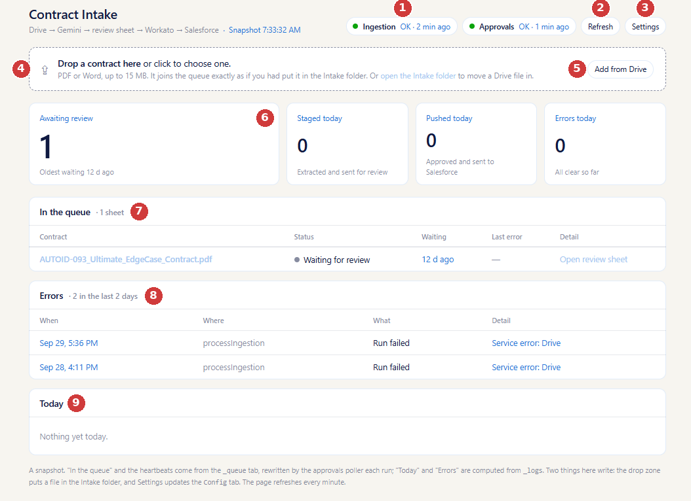
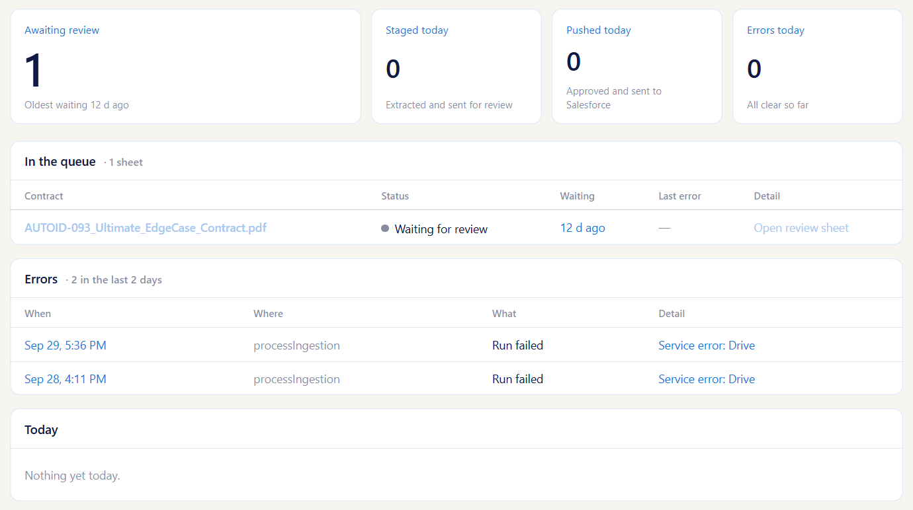
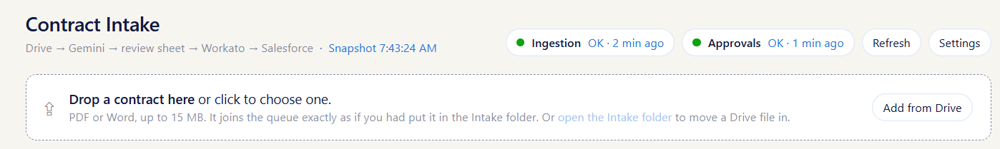
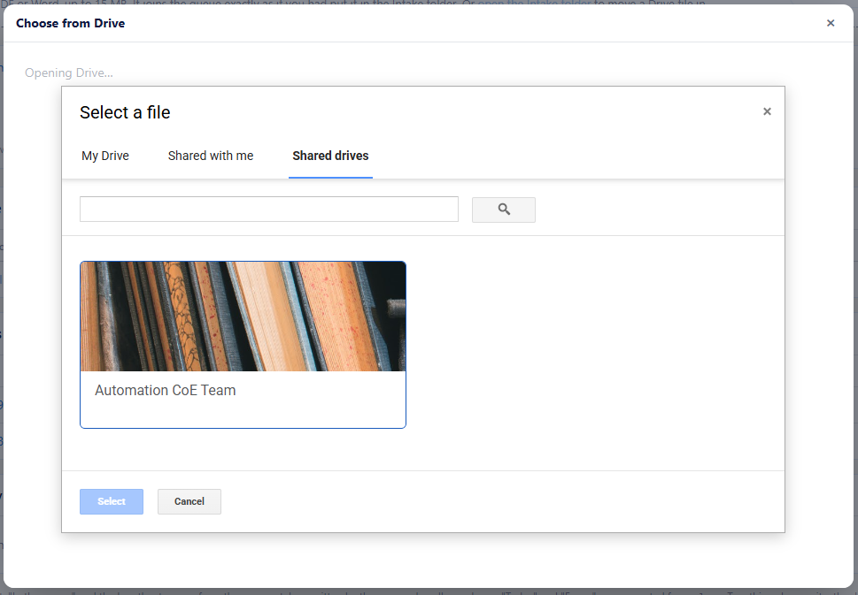
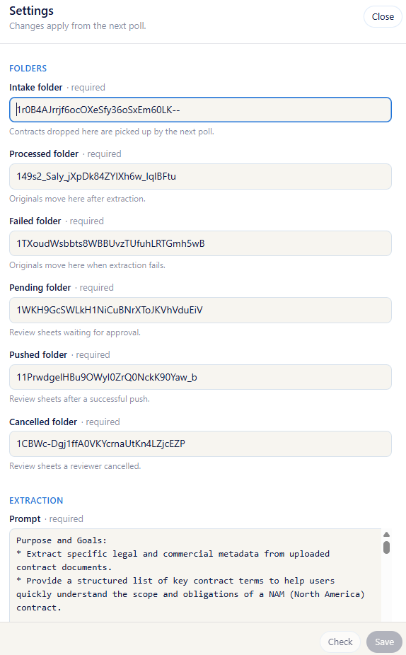
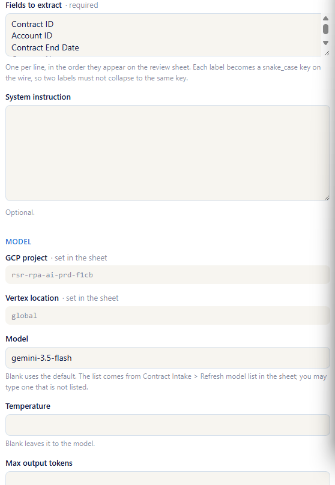

# What this page is

Contract Intake reads new contracts with Gemini, puts the extracted terms on a review sheet for a person to check, and sends the approved terms to Salesforce through Workato. The dashboard is the one place to see where every contract is and to add new ones.

Nothing on this page changes a contract. It is a snapshot that refreshes itself every minute; the only two things that write anything are the drop zone **(4)** and Settings **(3)**.

# Reading the page

**1 — Ingestion and Approvals.** Two background jobs run every few minutes: *Ingestion* reads new files and creates review sheets; *Approvals* looks for review sheets you have approved and pushes them on. Each pill shows when the job last ran. Green and "OK" means it is running on schedule. Amber or "Stale" means it has not run recently — usually harmless if it is a few minutes, worth telling the owner if it is hours.

**2 — Refresh.** The page refreshes on its own every minute and whenever you return to the tab. Refresh is there when you do not want to wait.

**3 — Settings.** Opens the configuration drawer. See *Changing the settings* below. Everyone can open it; only people on the settings list can save.

**4 — Drop zone.** Where new contracts go in. See *Submitting a contract*.

**5 — Add from Drive.** The same thing for a file that is already in Drive.

**6 — The four tiles.**

| Tile | What it counts | The small line underneath |
|---|---|---|
| Awaiting review | Contracts with a review sheet that nobody has approved yet | How long the oldest one has been waiting |
| Staged today | Contracts read today and sent for review | — |
| Pushed today | Review sheets approved today and sent to Salesforce | — |
| Errors today | Runs that failed today | "All clear so far" when zero |

Awaiting review is the one to watch. If it is growing, contracts are arriving faster than they are being approved.

**7 — In the queue.** One row per contract that still needs a decision. *Status* is where it is: *Waiting for review* is the normal state; *Error* means the last push failed and the reason is in *Last error* — fix the sheet and it will be retried on the next run. *Waiting* is how long it has sat there. The contract name opens the original file; **Open review sheet** opens the sheet you approve on (see *Reviewing a contract*).

**8 — Errors.** Anything that failed in the last two days, newest first. *Where* is the job that failed and *Detail* is the message. A one-off *Run failed* usually clears itself; the same error repeating is worth reporting.

**9 — Today.** Everything that happened today, newest first: files staged, sheets pushed, errors. Empty in the morning is normal.

# Submitting a contract

There are three ways in, and they all end in the same place — the Intake folder, where the next Ingestion run picks the file up.

**From your computer.** Drag a PDF or Word file onto the drop zone, or click the zone and choose one. Several at once is fine. Files up to 15 MB. A line appears under the zone for each file; once it says *Uploaded*, the file is in and you can close the page.

**From Drive.** Click **Add from Drive**. A picker opens on *My Drive*, with *Shared with me* and *Shared drives* as tabs. Choose the file and click **Select**. Google will ask you to confirm that Contract Intake may access the file you picked — this happens every time, for every file, and is expected. After you confirm, the file is copied into the Intake folder and a line under the drop zone says *Imported*.

{width=75%}

**From Drive, by hand.** The link *open the Intake folder* opens the folder itself; moving a file into it does exactly the same thing.

Within about five minutes the contract appears under *In the queue* with a review sheet, and a card is posted to the team Chat space.

# Reviewing a contract

<!-- TODO: add a screenshot of a review sheet as img/07-review-sheet.png and uncomment the next line -->
<!--  -->

Click **Open review sheet** on the contract's row in *In the queue*. The sheet is a plain Google Sheet. At the top is a short block about the contract — the original file, when it was read, its status, and the **Approved?** and **Cancel?** boxes. Below that is a grid with three columns: *Field*, *Extracted* (what Gemini read) and *Approved* (what will be sent). The Approved column starts as a copy of Extracted; correct anything there that is wrong, and leave Extracted as it is — it stays with the record so the correction is visible later.

When the values are right, tick **Approved?** at the top. Nothing happens the instant you tick it; the Approvals job finds the sheet on its next run, sends the values to Salesforce, and moves the sheet out of the queue. On the dashboard the contract leaves *In the queue*, *Pushed today* goes up by one, and a line appears under *Today*.

If the contract should not go to Salesforce at all, tick **Cancel?** instead. The sheet is moved aside and the contract leaves the queue without being sent.

If a push fails, the row stays in the queue with *Status: Error* and the reason under *Last error*. Fix the value it names on the sheet — the **Approved?** tick is kept — and it is retried on the next run.

# Changing the settings

Click **Settings** (3). The drawer shows every setting the tool runs on, grouped by what it affects. Anyone can open it and read; saving needs your email on the *Who may edit settings* list, or you are the dashboard owner.

{width=55%}

**Folders** are where files live at each stage. These rarely change; if you do change one, make sure the dashboard owner can open the new folder, or nothing will land there.

**Extraction** is the part you are most likely to touch. *Prompt* is what Gemini is told before it reads a contract. *Fields to extract* is the list of terms it looks for, one per line, in the order they appear on the review sheet — adding a line here adds a row to every review sheet created afterwards. Sheets already in the queue are not changed.

{width=55%}

**Model** picks which Gemini model reads contracts; the list is the models this project can use, and you may type one that is not listed. *Temperature* and *Max output tokens* can stay blank.

**Integrations** and **Dashboard** hold the Chat webhook, the two access lists (who may upload, who may edit settings) and the support contact shown on the page.

Some settings are shown greyed with *set in the sheet* — the GCP project, the Vertex location, and the Workato endpoints. Those are wiring, not settings, and are changed by the owner directly.

**Check** validates everything you have entered without saving; problems are shown next to the field. **Save** validates the same way and then writes. Changes apply from the next run of the background jobs — a few minutes — not to anything already in flight. If someone else saved while you had the drawer open, Save refuses and asks you to reload the form so you can see their changes first.

# When something looks wrong

*A red banner saying "Not loaded".* The page could not read its data. It retries every minute; if it persists, the banner names who to contact.

*An amber notice about access.* The page loaded but could not read one of its sources, and says which. The rest of the page is still correct.

*A pill showing "Stale".* The job has not run recently. Wait one poll; if it stays stale, tell the owner.

*The same contract keeps showing "Error".* Open the review sheet and read *Last error* — it names the value Salesforce or Workato rejected.

*Add from Drive shows a blank panel.* The first time you use it, Google needs you to sign in for the picker once. The panel offers a link to do that in a new tab; afterwards, click **Add from Drive** again.
